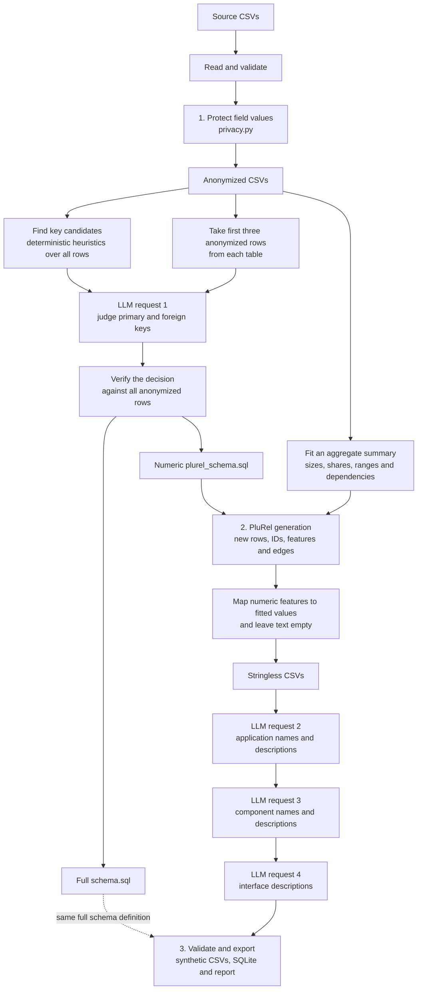

# EAGLE synthetic-data conference demo

A small demo for *Beyond Attribute Anonymization: Structure-Preserving
Synthetic Data Generation for LLM-Assisted Enterprise Architecture Analysis*.

The storyline is:

1. Start with three connected CSV files describing a fictional application landscape.
2. Hide sensitive attribute values with different anonymization and pseudonymization
   techniques. The graph nevertheless stays identical, so the dependencies
   can still disclose sensitive architectural information.
3. Generate a new application landscape. It keeps the schema, foreign-key integrity, row counts,
   and selected attribute distributions, but contains new records, identifiers, and edges.

## Run

From the root directory execute:

```bash
uv sync --locked
uv run python demo.py
```

Open `output/report.html` when it finishes. A typical run takes about 15–20 seconds and makes
four LLM requests: one schema judgement, followed by one text-infill request for each table (so 3 text-infill requests total).
The input is intentionally small: 8 applications, 16 components, and 18 interfaces.

The demo needs `OPENAI_API_KEY` in the environment or in `.env`. It uses
`gpt-5.4-mini`. Options are `--seed`, `--data`, and `--out` (resolved relative
to `demo.py`).

## Report

The standalone HTML report is designed as a presentation aid:

- Source, anonymized, and synthetic component graphs side by side. Node color denotes the application and node size denotes degree.
- One real before/after example for each field operation.
- Tabs for the source, anonymized, PluRel/stringless, and final synthetic CSVs.
- A small comparison table for row counts and graph measures.

The source and anonymized graphs are exactly equal. The synthetic graph deliberately is not an isomorphic relabelling of the source graph.

## Pipeline



For the bundled 8/16/18-row dataset this makes four LLM requests: one schema judgement and one
text-infill request for each table. Text requests are batched at 25 rows, so larger inputs may
require more than four requests (if other data than the bundled one is used).

### Input and preflight

The three files in `data/` become the `applications`, `components`, and `interfaces` tables.
Numeric-looking CSV values are read as numbers, then the input is checked for non-empty, unique
identifiers, finite numbers, and valid application/component references.

### Step 1: protect field values

`privacy.py` assigns one field operation to every sensitive column:

- Application and component names and owners receive deterministic, reversible word-list
  pseudonyms. Their mapping is written to `pseudonym_map.json` and must itself be treated as
  sensitive with real data.
- Descriptions are deleted and `cost_center` is removed entirely.
- IP addresses retain their leading octet and have the rest masked.
- Annual costs are deterministically distorted by at most 20%, and dates are shifted within
  their original year.
- Columns not named in the protection plan, including identifiers, foreign keys, categories,
  protocols, and ports, are retained.

This stage illustrates the limitation of attribute protection:
pseudonymizing labels does not hide who depends on whom.

### Step 2: generate a new relational landscape

Step 2 first learns the relational *kind* of the data, then generates a different instance of
that structure.

#### 2a. Propose and judge the schema

The deterministic heuristic examines every anonymized row. It proposes a primary-key candidate
when a column is complete and unique, and a foreign-key candidate when all of one column's values
occur in a unique column of another table. This deliberately overproduces candidates: for
example, `applications.name` happens to be unique, and the numeric ID ranges create some
coincidental subset relationships.

The first LLM request resolves that semantic ambiguity. It receives only:

- the first three **anonymized** rows of each table; and
- the primary- and foreign-key candidates computed over all rows.

The call uses `gpt-5.4-mini`, low reasoning effort, a single user message, and JSON response mode.
There is no system message. In abbreviated form, its payload is:

```python
OpenAI().chat.completions.create(
    model="gpt-5.4-mini",
    reasoning_effort="low",
    response_format={"type": "json_object"},
    messages=[{
        "role": "user",
        "content": """
        These are anonymized CSV exports ...

        First three rows of each table:
        {"applications": [...], "components": [...], "interfaces": [...]}

        Heuristics found these key candidates:
        {
          "primary_key_candidates": {
            "applications": ["application_id", "name", "annual_cost_eur", "go_live_date"],
            "components": ["component_id", "name"],
            "interfaces": ["interface_id"]
          },
          "foreign_key_candidates": [...]
        }

        Pick the primary key of each table, and keep only the foreign keys that
        are real references. Reply as JSON.
        """
    }],
)
```

The expected decision for this landscape is:

```json
{
  "primary_keys": {
    "applications": "application_id",
    "components": "component_id",
    "interfaces": "interface_id"
  },
  "foreign_keys": [
    ["components", "application_id", "applications"],
    ["interfaces", "source_component_id", "components"],
    ["interfaces", "target_component_id", "components"]
  ]
}
```

To not trust the reply blindly, `pipeline.py` verifies on all anonymized rows that each chosen
primary key exists and is unique, and that every chosen child value occurs in the chosen parent
key. An invalid decision stops the run. These checks establish data consistency, although the
LLM is still responsible for the semantic choice between candidates that are equally valid by
those syntactic tests.

From the verified decision the pipeline writes two schemas:

- `schema.sql` records the complete inferred schema, including text columns. The pipeline retains
  that schema in memory and uses it to create and validate the final SQLite export. It does not
  reread the artifact from disk.
- `plurel_schema.sql` contains only primary keys, foreign keys, and numeric feature slots. This is
  the schema PluRel can consume. Text columns are intentionally absent.

The candidates and selected decision are recorded together in `schema_decision.json`.

#### 2b. Fit the allowed summary

In parallel with the schema representation, `synthesis.py` reduces the anonymized tables to the
small aggregate summary needed to realize the generated data:

- table row counts;
- category counts for criticality, component type, network zone, and protocol;
- the minimum and maximum cost and date;
- the number of owners and their portfolio sizes, relabelled as `Team 01`, `Team 02`, etc.; and
- two observed dependencies: protocol to port, and network zone to masked address.

No source row, source identifier, pseudonym, or source edge is included in this summary. It also
contains no graph statistics such as degree or connected components.

#### 2c. Generate with PluRel and realize the features

PluRel receives the reduced SQL schema and requested row count for each table. It produces a new
relational graph plus one numerical feature per non-key field in that schema. The pipeline then:

1. assigns fresh public identifiers such as `syn-app-001`, `syn-cmp-001`, and `syn-ifc-001`;
2. maps generated feature ranks onto the fitted category counts and owner portfolio sizes;
3. scales generated numerical features into the fitted cost and date ranges;
4. derives ports from protocols and masked addresses from network zones; and
5. creates the omitted name and description columns with empty values.

The result is written to `output/stringless/`. It has new records and edges, valid foreign keys,
the original table sizes, and the selected aggregate characteristics, but no generated prose.

### Step 3: fill names and descriptions with the LLM

The remaining LLM requests operate only on generated rows. Tables are processed parent-first so
later prompts can use names already assigned to related rows:

1. applications: generate a distinct name and a short description;
2. components: generate a distinct name and description, with the generated parent application
   ID replaced in the prompt by its generated name; and
3. interfaces: generate a description, with both generated component IDs replaced by their
   generated names.

For example, an application context sent to the model looks like:

```json
{
  "application_id": "syn-app-001",
  "owner": "Team 03",
  "criticality": "High",
  "annual_cost_eur": 80192,
  "go_live_date": "2015-02-12"
}
```

The requested response is keyed by the generated identifier:

```json
{
  "syn-app-001": {
    "name": "Supplier Risk Monitor",
    "description": "Supports ongoing assessment of supplier performance, exposure, and compliance across the vendor base."
  }
}
```

The prompt asks for concise architecture-inventory prose consistent with the row and related
names, while forbidding repetition of identifiers or explicit mention of cost, dates, categories,
network details, or the fact that the data is synthetic. Every requested text must be present and
non-empty or the run stops.

Finally, the complete tables are checked again for primary-key and foreign-key integrity, written
to `output/synthetic/`, inserted into SQLite with foreign-key enforcement enabled, and summarized
in the standalone HTML report.

### What each generator sees

| Consumer | Receives | Does not receive |
| --- | --- | --- |
| Schema-judge LLM | First three anonymized rows per table; candidates computed from all rows | Original names/descriptions; removed `cost_center`; pseudonym map |
| PluRel | Reduced SQL schema; row count per table | Source/anonymized rows, IDs, pseudonyms, edges, category labels, or graph metrics |
| Deterministic realization | PluRel rows; fitted category counts, ranges, portfolios, and two dependencies | Source rows and source edges |
| Text-infill LLM | Generated rows and generated parent names | Source/anonymized rows, source IDs, pseudonyms, and source edges |


## Output

| Path | Contents |
| --- | --- |
| `output/report.html` | Standalone presentation report |
| `output/source/` | Copy of the toy input CSVs |
| `output/anonymized/` | Same rows and edges after field operations |
| `output/stringless/` | New PluRel rows before text infill |
| `output/synthetic/` | Final CSVs and validated SQLite database |
| `output/schema.sql` | Induced relational schema |
| `output/plurel_schema.sql` | Numeric projection of the schema passed to PluRel |
| `output/summary.json` | Fitted inputs and checked comparison results |
| `output/schema_decision.json` | Candidate keys and the LLM judge's selection |
| `output/pseudonym_map.json` | Reversible original-to-pseudonym mapping |
| `output/plurel.log` | PluRel's verbose output, kept out of the presentation terminal |

## Code and tests

The implementation is split by responsibility: `demo.py` orchestrates, `privacy.py` performs field operations, `pipeline.py` handles CSVs, schema induction, validation, and SQLite,
`synthesis.py` integrates PluRel, `llm.py` contains the two LLM stages; and `report.py` creates the HTML page.


Tests: 

```bash
uv run pytest -q
uv run ruff check .
uv run ruff format --check .
```

Ordinary tests do not call the API. To include the live judge and end-to-end checks explicitly:

```bash
RUN_LIVE_TESTS=1 uv run pytest -q
```
